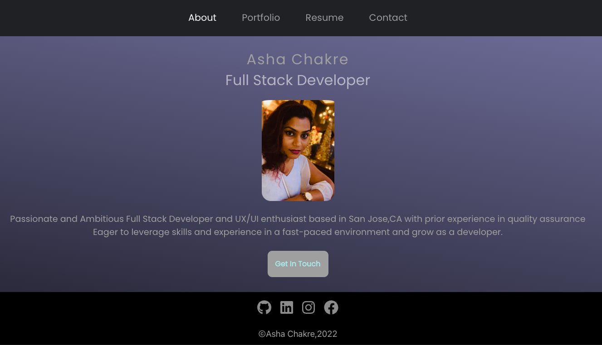

## Description

In this challenge we are creating React portfolio which includes the following.
- A single Header component that appears on multiple pages

- A single Navigation component within the header that will be used to conditionally render the different sections of your portfolio

- A single Project component that will be used multiple times in the Portfolio section

- A single Footer component that appears on multiple pages

[DEPLOY URL](https://ashachakre0906.github.io/react-portfolio/)

[SOLUTION URL](https://github.com/ashachakre0906/react-portfolio)

### Live Demo
###### The following animation demonstrates the application functionality


## User Story
```md
AS AN employer looking for candidates with experience building single-page applications
I WANT to view a potential employee's deployed React portfolio of work samples
SO THAT I can assess whether they're a good candidate for an open position
```
## Acceptance Criteria
```md
GIVEN a single-page application portfolio for a web developer
WHEN I load the portfolio
THEN I am presented with a page containing a header, a section for content, and a footer
WHEN I view the header
THEN I am presented with the developer's name and navigation with titles corresponding to different sections of the portfolio
WHEN I view the navigation titles
THEN I am presented with the titles About Me, Portfolio, Contact, and Resume, and the title corresponding to the current section is highlighted
WHEN I click on a navigation title
THEN I am presented with the corresponding section below the navigation without the page reloading and that title is highlighted
WHEN I load the portfolio the first time
THEN the About Me title and section are selected by default
WHEN I am presented with the About Me section
THEN I see a recent photo or avatar of the developer and a short bio about them
WHEN I am presented with the Portfolio section
THEN I see titled images of six of the developer’s applications with links to both the deployed applications and the corresponding GitHub repository
WHEN I am presented with the Contact section
THEN I see a contact form with fields for a name, an email address, and a message
WHEN I move my cursor out of one of the form fields without entering text
THEN I receive a notification that this field is required
WHEN I enter text into the email address field
THEN I receive a notification if I have entered an invalid email address
WHEN I am presented with the Resume section
THEN I see a link to a downloadable resume and a list of the developer’s proficiencies
WHEN I view the footer
THEN I am presented with text or icon links to the developer’s GitHub and LinkedIn profiles, and their profile on a third platform (Stack Overflow, Twitter) 
```


### Code Snippets
***In the below portfolio component function.I have created an array of projects.Mapping through each and every project in array by its index and return will render the card dynamically.I am able to use JSX expressions to render variables in my components. ***
```js
return (
    <div className="grid">
      {projectsInfo.map((project, i) => {
        return (
          <a className="card-link" href={project.githuburl} target="_blank">
            <div key={i} className="card">
              
              <div className="card-body">
                <h5 className="card-title">{project.title}</h5>
                <p className="card-text">{`${project.description.substring(
                  0,
                  100
                )}...`}</p>
```

## Technologies Used


## Credits
Thank you all TA's and my tutor Joem Casusi for helping debugging the errors in my code.

## Questions
Please reach out to me:<br>
Email Address: chourpagar.asha@gmail.com <br>
Github Repo URL:[GitHub](https://github.com/ashachakre0906)